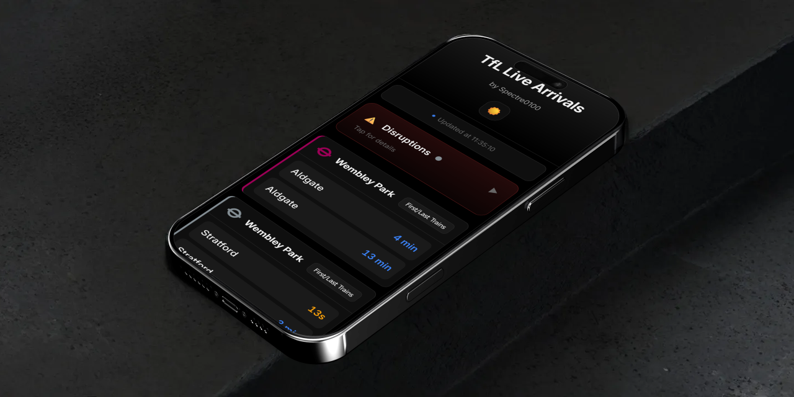
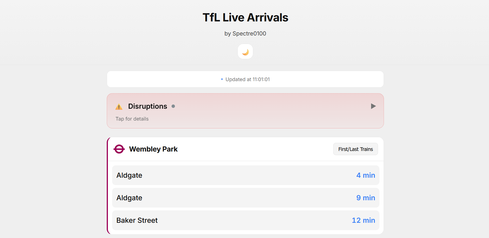
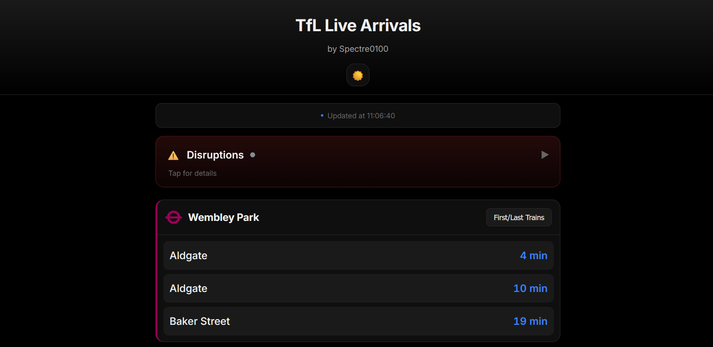

# TfL Live Arrivals
A lightweight webpage which uses the TfL API to display the next train arrival times at stations. Works for the London Underground, DLR and Elizabeth Lines.

## Version 0.5
Added a new light UI theme, with various quality of life improvements.

### Preview

#### Light theme

#### Dark theme (Default)

### 🔎 What's new?
1. Added a new light theme with a simple toggle at the top of the page, and your preference is saved!
2. Disruptions now show a preview of affected lines before expanding details.
3. Clicking outside the timetable window now closes it.
4. Refresh window is now 10s to minimise hitting API rate limits.
5. Improved timetable window code implementation.  
6. Added a favicon!

### Known Issues
- API issues persist:
    - Sometimes null values are returned for destination stations of first/last trains
    - Some first/last train times are still wrong

## Version 0.4
Added button to show timetables for the first and last trains at each station.

### Known Issues
- Wembley Park Metropolitan station shows an incorrect time for the last service to Baker Street, and also only has Monday-Thursday times (API issue)
- Elizabeth line stations do not have any timetable info (also an API issue)

## Version 0.3
Complete design and code overhaul with a more modern UI.

### 🔎 What's new?
1. A sleek and colourful new look! 
2. Further simplification of the stations/lines editing process.
3. Added Wembley Park Jubilee and Metropolitan line stations.

## Version 0.2
New feature: disruptions! + massively streamlined JS with more modular code.

### 🔎 What's new?
1. New disruptions section: see the latest line statuses and causes of delays.
2. Simplified HTML: elements are now created through JS.
3. Now much simpler to add new stations and lines: minimised the amount of typing needed! 
4. Added Tottenham Court Road Station.

## Version 0.1
The first official release. Overhauled the UI and added quality of life improvements.

### 🔎 What's new?
1. A modern interface that's easy to read and use (mobile friendly).
2. Colour-coded stations with useful status messages.
3. Data refreshes every 5 seconds, with more accurate times than the TfL Go app.
4. Now has loading animations!
